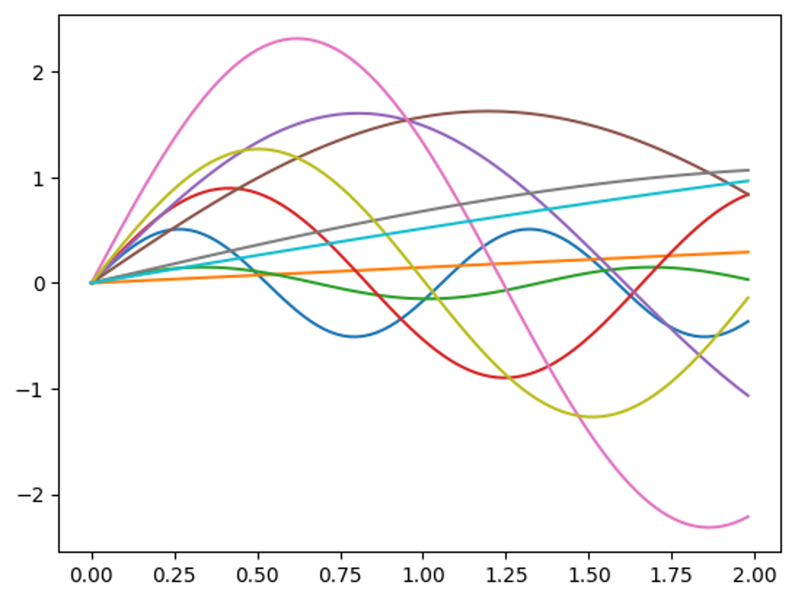
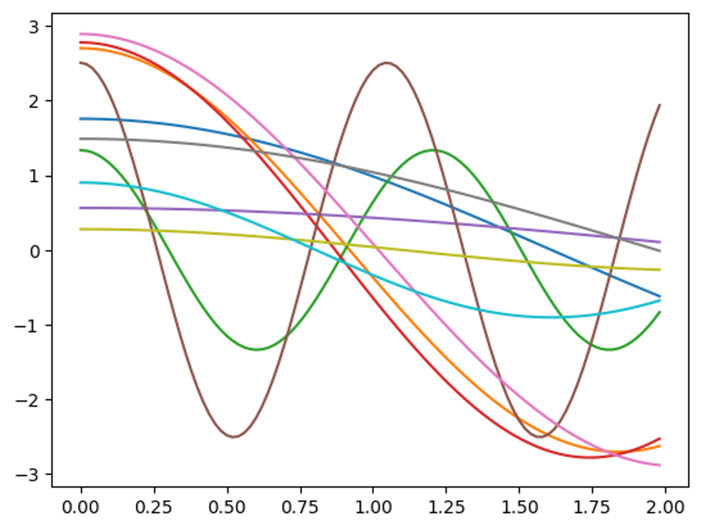
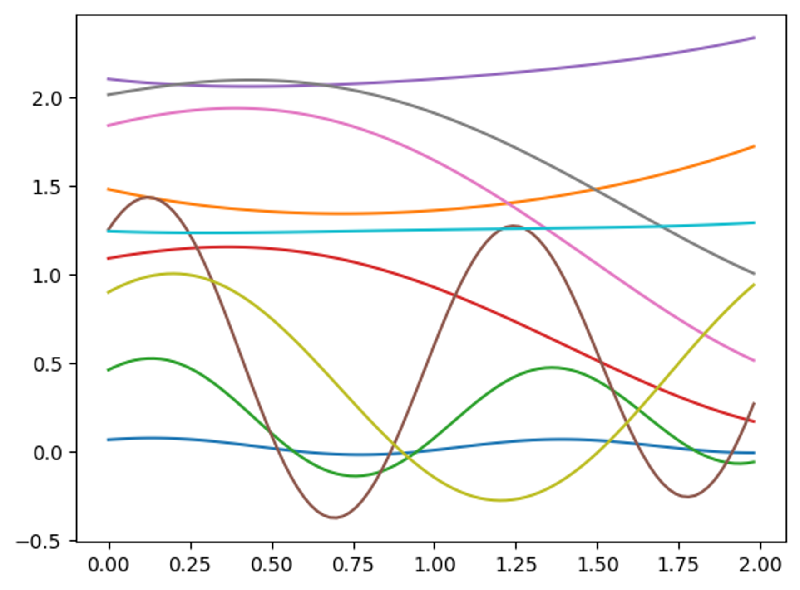
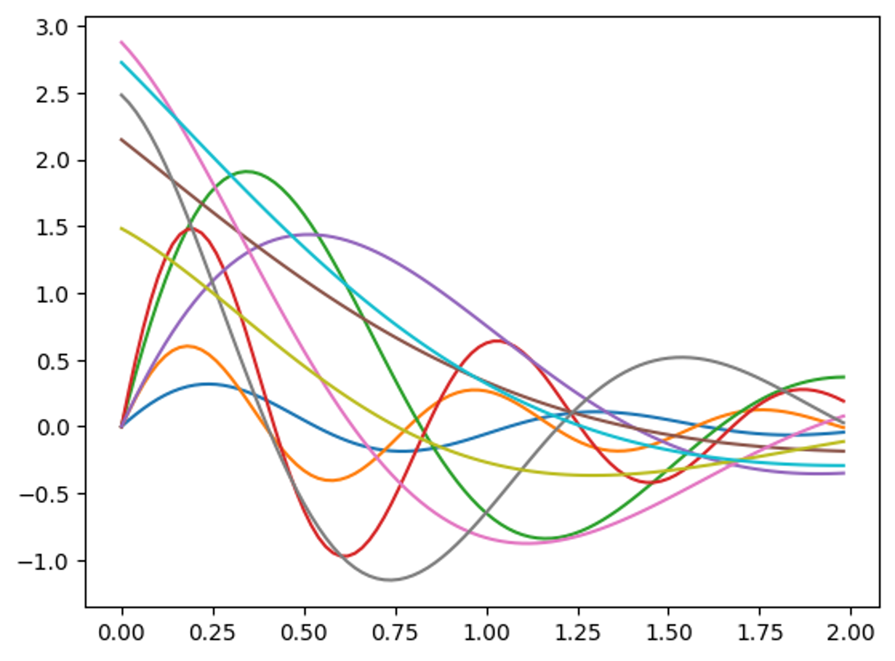
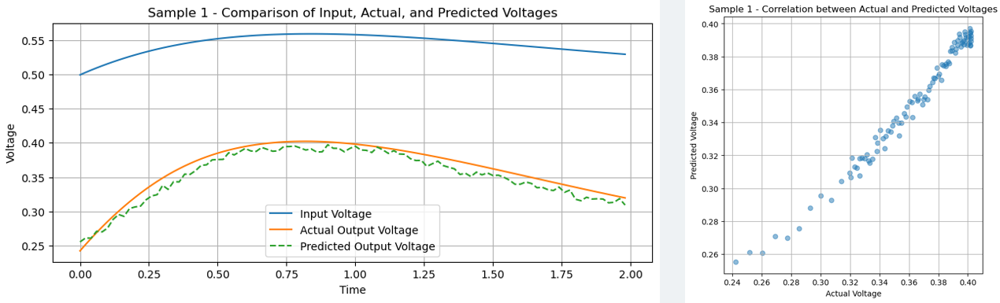
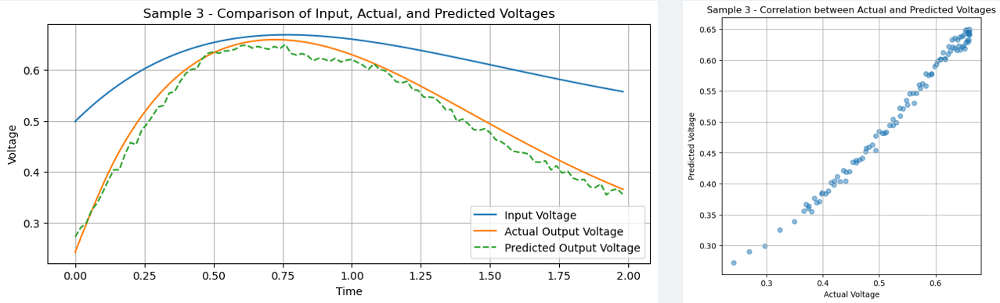
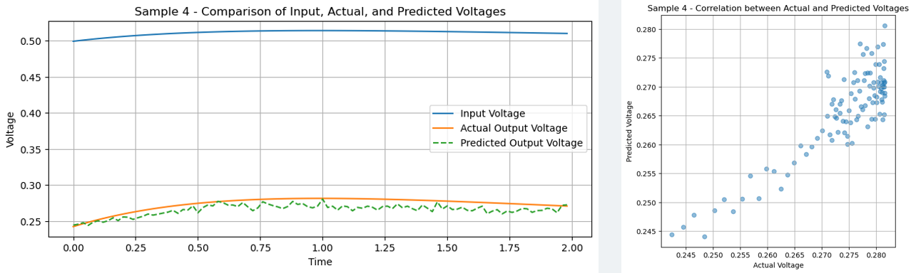
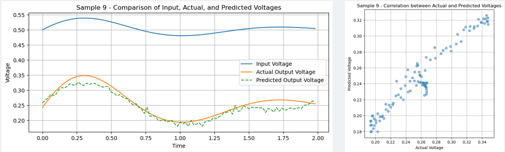
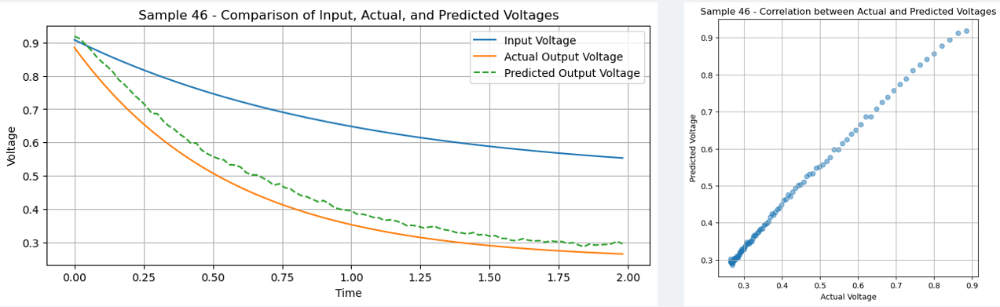
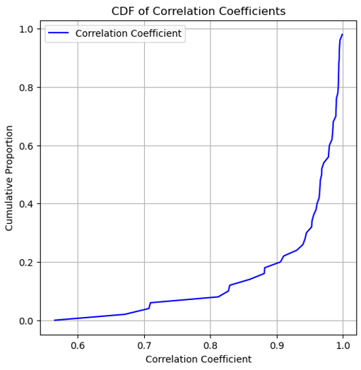

# DeepLearning-PhysicalComponents-ResponseModel
The Simulation Model of The Response of Physical Components Based on Deep Learning

## Abstract
With the continuous advancement of electronic design automation(EDA), simulation tools play a crucial role in circuit design and testing. However, the complexity of these tools often makes it difficult for beginners to quickly master them, limiting the widespread adoption of simulation technology. This paper explores the potential application of deep learning technology in the field of circuit simulation, aiming to enhance the efficiency of design and testing by simulating circuit properties. Deep learning, with its exceptional data processing capabilities, automatic feature extraction, pattern recognition accuracy, generalization ability, adaptability and flexibility, parallel processing capabilities, continuous learning and optimization, innovative network structures, ensemble learning, and cross-domain applications, provides a revolutionary solution for circuit simulation. In this project, we used ADS simulation software to build circuit models and employed the PyTorch framework to develop deep neural networks to simulate circuit responses and predict their outputs. By training on a large and diverse dataset and through meticulous optimization, our neural network can accurately predict circuit outputs within a small error range. The research results indicate that deep learning networks can not only significantly improve the efficiency of circuit design and testing but also have the potential to simplify the complex process of traditional circuit construction, bringing innovation and breakthroughs to the field of circuit simulation.

## Dataset
```.bash
# Generate Smooth Waveform
smooth_raw_data_generator.ipynb

# Generate Waveform with Noise on it
noise_raw_data_generator.ipynb

# Convert TXT to DS
convert_txt_ds.ipynb
```
### Train Set
We employ five distinct waveforms as our model's training set. To ensure the robustness and variability of our training data, we generate 50 examples of each waveform with random variations. Each waveform's amplitude is constrained between -3 and 3, while the frequency ranges from 0 to 2. Sampling each waveform with 100 sampled points as train data.







### Test Set
Two waveforms are used as the test set in this project. Similar to the training set, 50 examples of each test waveform are generated with random variations. The amplitude of each waveform is constrained between -3 and 3, and the frequency ranges from 3 to 4. Sampling each waveform with 100 sampled points as test data.



## Deep Learning Network
The network architecture utilized in this project is a combination of a Convolutional Neural Network (CNN) and a Fully Connected Network (FCN). The input dimension is 100, and the output dimension is also 100.


## Result






